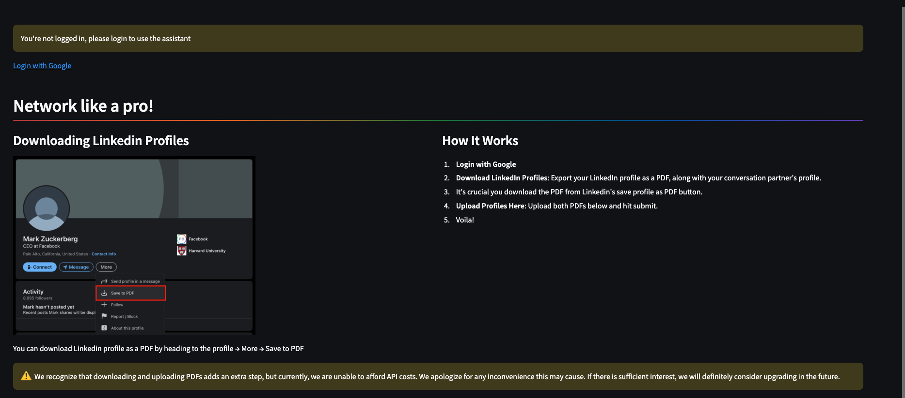
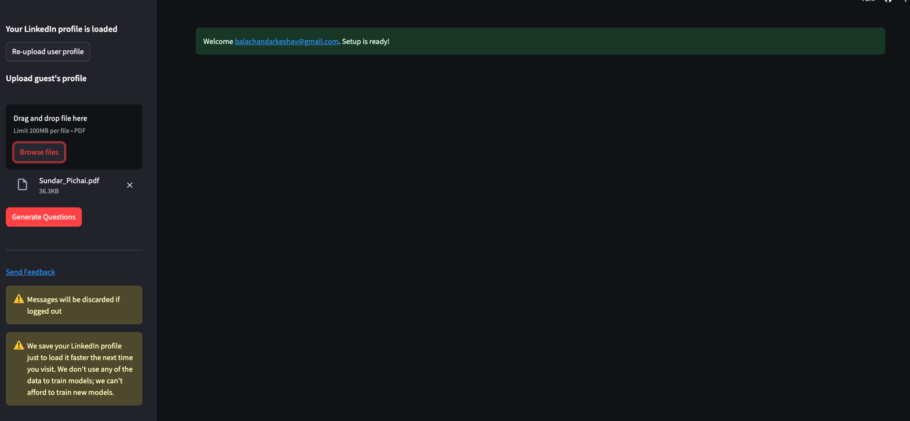
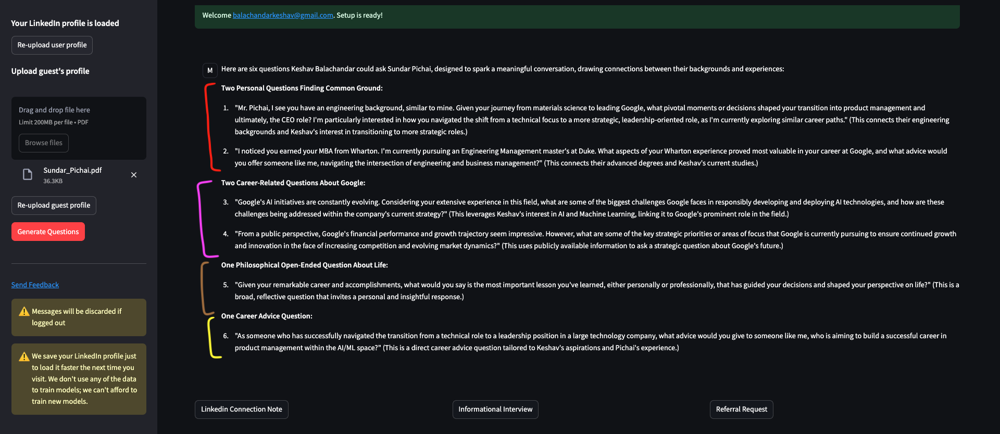

# LinkedinConvoHelper
Gets context about user profile and target profile, and helps to frame questions user can ask the target

Check it out here: https://linkedinconversationassistant.streamlit.app/

## Step 1: Sign in with Google

## Step 2: Upload your LinkedIn profile & the profile of the person who you want to network with. As a PDF!!

## Step 3: That's it! You get a bunch of questions you can ask the other person. Interact with the agent to generate more as well.

Try it out and send your feedback.

